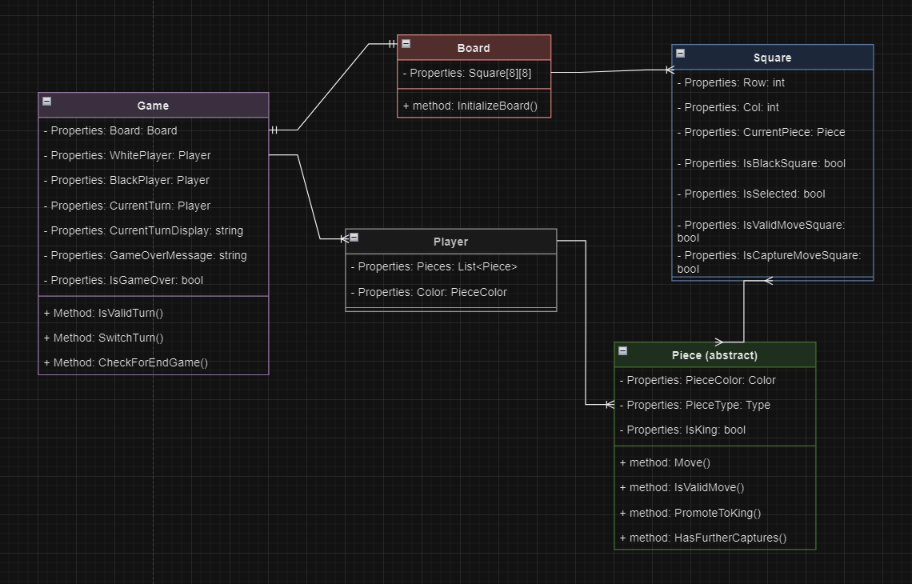

# MAUICheckersGame

**MAUICheckersGame** is a cross-platform checkers game built with .NET MAUI. The application provides a clean and interactive interface for playing checkers, featuring a dynamic board, real-time move validation, and game state management.

---

## Features

- **Interactive Board:** An 8x8 grid dynamically updated with pieces, moves, and captures.
- **Turn-Based Gameplay:** Displays the current player's turn, alternating after valid moves.
- **Move Validation:** Highlights valid moves and captures for selected pieces.
- **King Promotion:** Pieces are promoted to "Kings" upon reaching the opponent's back row.
- **Game Over Management:** Detects end-of-game conditions and displays results with an option to restart.
- **Simple Interface:** Intuitive UI with easy navigation and board interaction.

---

## Game Design

### 1. **Minimum Requirements**

### User Stories:

- **US1:** As a player, I want a board with 8x8 squares to start the game.
- **US2:** As a player, I want to move my pieces according to the rules of American Standard Checkers. (Reference: [Checkers Game - Play for Free!](https://www.online-checkers.com/))
- **US3:** As a player, I want to see a notification when one of my pieces is captured.
- **US4:** As a player, I want my piece to become "King" when it reaches the opponent's back row.
- **US5:** As a player, I want to get notified when I win.
- **US6:** As a player, I want a simple and intuitive interface to track and manipulate the board.

### Use Cases:

- **UC1: Board Setup**
    - The 8x8 board will be initialized with 12 pieces for each side in their initial positions.
- **UC2: Moving Pieces**
    - Players can only move their pieces diagonally.
    - Pieces can only move forward (unless they are "Kings").
    - Pieces will "capture" an opponent by jumping over an opponent's piece.
- **UC3: King Promotion**
    - When a player's piece moves to the opponent's back row, it becomes a "King" and possible to move back (can move in 4 directions diagonally).
- **UC4: Ending the Game**
    - The game ends when a player has no more pieces or no more valid moves (being blocked).

---

### 2. **UML Diagram**


---

## How It Works

1. **Game Initialization**:
    - The `Board` model creates an 8x8 grid of `Square` objects.
    - Black and White pieces are placed on alternating dark squares in the first three and last three rows, respectively.
2. **Gameplay**:
    - Players take turns moving pieces diagonally on dark squares.
    - Valid moves include regular diagonal moves or capturing an opponent's piece by jumping over it.
    - Captured pieces are removed from the board.
3. **Turn Switching**:
    - The `Game` model manages turn switching between players.
    - Invalid moves are rejected, and the current turn remains unchanged.
4. **Winning Conditions**:
    - A player wins if the opponent has no pieces left or no valid moves.
5. **Data Binding**:
    - The `CheckersGameViewModel` handles the logic for updating the UI based on the game state.

---

## Installation

1. Clone this repository:
    
    ```bash
    git clone https://github.com/Quynhlien44/MAUICheckersGame
    cd MAUICheckersGame
    ```
    
2. Open the solution in Visual Studio 2022 with .NET MAUI workload installed.
3. Build and run the project on an emulator or physical device.

---

## Usage

1. Launch the app.
2. Use touch or mouse to select and move pieces on the board.
3. Follow the game rules to capture opponent pieces and win the game.

---

## Technologies Used

- **.NET MAUI:** Cross-platform framework for native mobile and desktop apps.
- **MVVM Toolkit:** Enables clean ViewModel-View separation.
- **XAML and C#:** For UI design and application logic.
- **Semantic Accessibility:** Enhances usability for screen readers and accessibility tools.

---

## Known Issues

- Edge cases in game-over detection may require improvement.
- UI animations for moves and captures are not yet implemented.

---

## Future Enhancements

- **AI Integration:** Add a single-player mode with varying difficulty levels.
- **Visual Improvements:** Introduce animations for moves and captures.
- **Scalable Architecture:** Prepare the app for online multiplayer functionality.
- **Accessibility:** Expand accessibility features for better inclusivity.